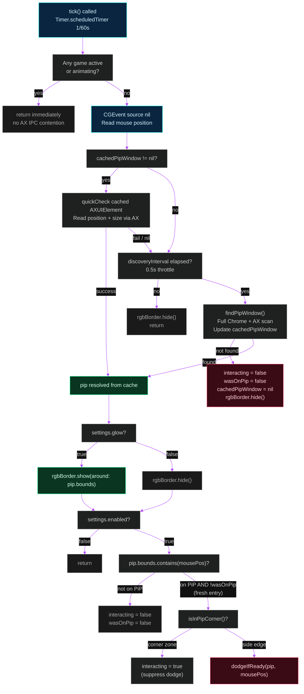
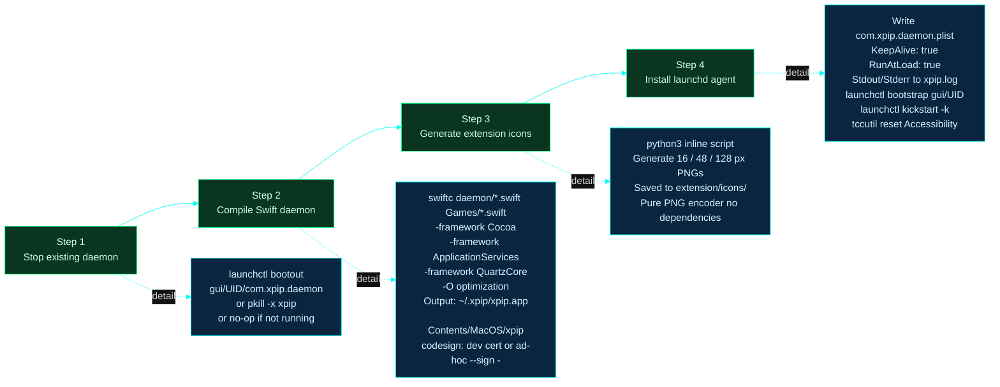
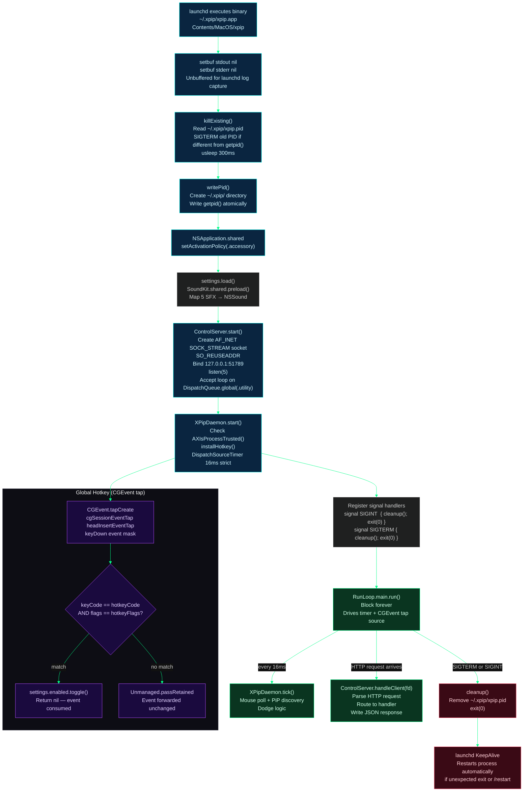
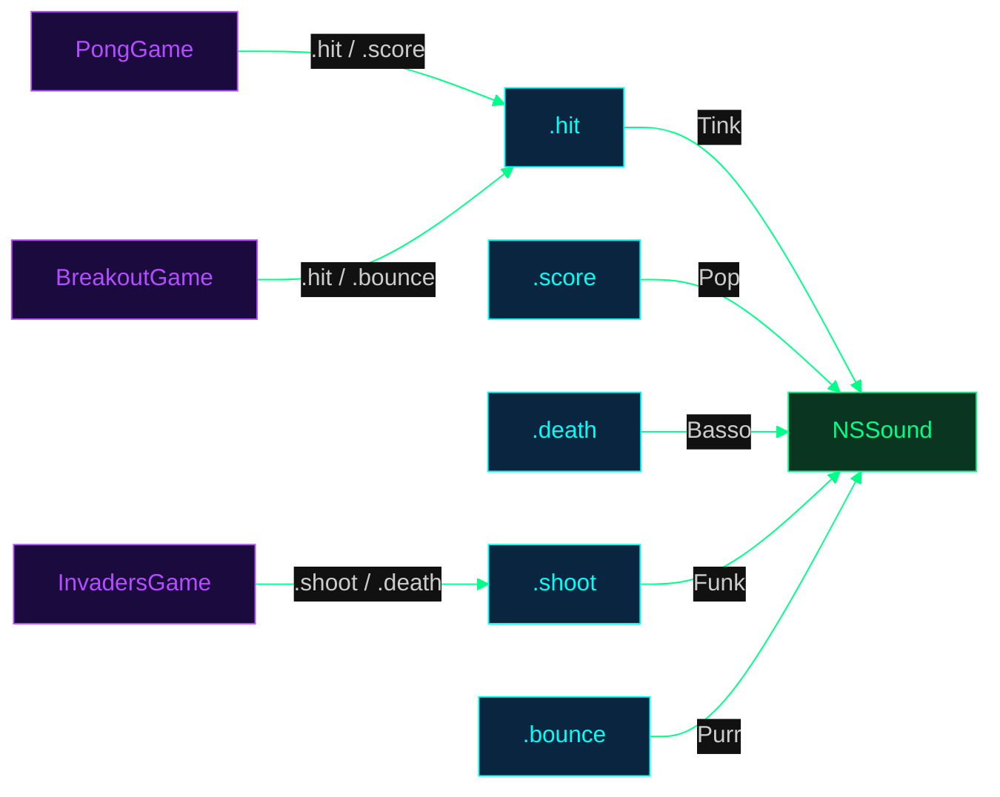
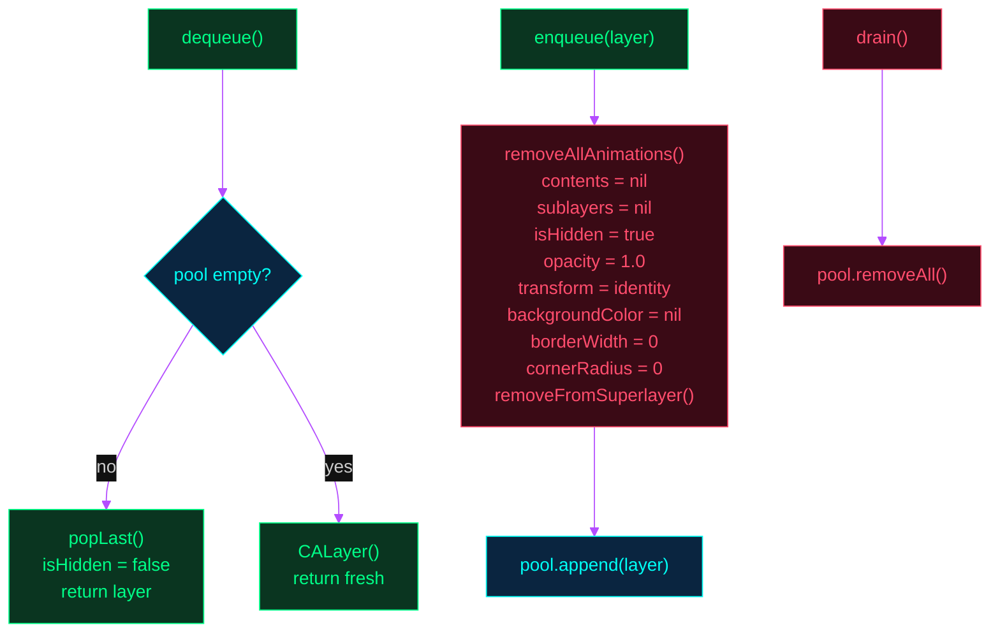
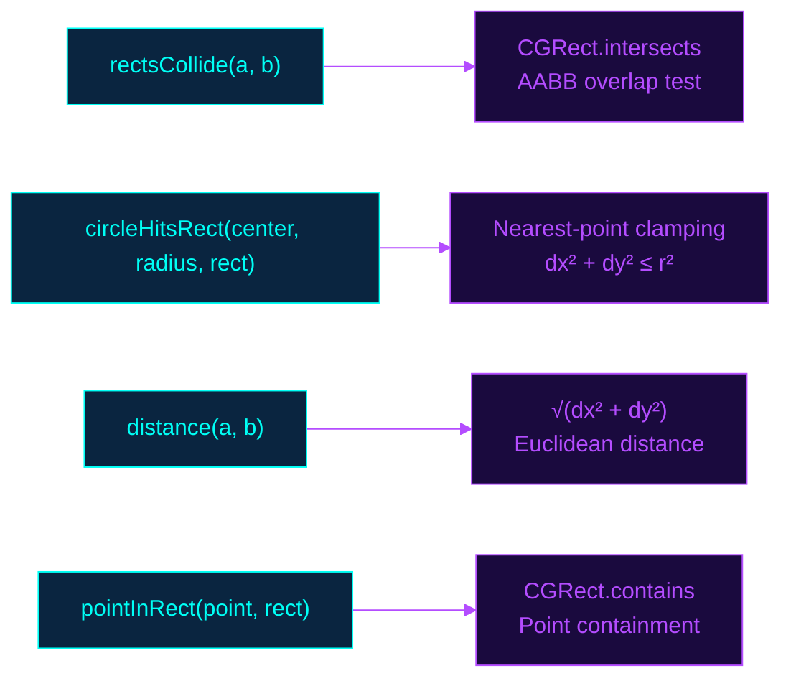

# XPip — Architecture

 

XPip is a macOS background daemon plus a Chrome extension that makes Picture-in-Picture windows dodge the mouse cursor and doubles as a retro arcade platform. This document covers the overall system architecture, daemon internals, and process lifecycle. For detailed treatment of the dodge algorithm and PiP detection see [DODGE-SYSTEM.md](./DODGE-SYSTEM.md); for the game engine and all thirteen game modes see [GAME-ENGINE.md](./GAME-ENGINE.md); for the glow border and sacred geometry burst system see [RGB-BORDER.md](./RGB-BORDER.md); for the HTTP API see [API-REFERENCE.md](./API-REFERENCE.md).

---

## Diagram color legend

All Mermaid diagrams in this documentation follow a consistent color system:

| Color | Hex | Meaning |
|-------|-----|---------|
| Cyan | `#00fff5` | Data flow / discovery / polling |
| Purple | `#b44dff` | UI / rendering / overlays |
| Green | `#00ff88` | System / lifecycle / infrastructure |
| Red | `#ff4d6d` | Events / actions / mutations |

---

## System Architecture Overview

XPip is organized into three cooperating layers that span two processes and the macOS kernel:

1. **Browser Extensions** — Manifest V3 extensions for Chrome and Safari. They provide the user-visible popup UI, issue commands to the daemon over localhost HTTP, inject content scripts that interact with the browser's Picture-in-Picture API to enter/exit PiP mode, and report per-PiP audio volume state for bidirectional volume control. Content script API calls are proxied through the background script to bypass Safari's mixed-content restrictions.

2. **Swift Daemon** — A native macOS process compiled with `swiftc` and managed by `launchd`. It runs a raw BSD socket HTTP server on port 51789, polls the mouse position at 60 fps, discovers PiP windows through the Accessibility API, animates dodges, renders an always-on-top gradient border, and drives thirteen mini-game engines.

3. **macOS System APIs** — The daemon relies on three kernel-level subsystems: the Accessibility API (`AXUIElement`) for reading and writing PiP window geometry, the CGEvent API for global mouse polling and keyboard event tapping, and the WindowServer (`CGWindowList` + `NSWindow`) for floating overlay windows.

The diagram below shows every significant component in all three layers and the connections between them. Arrows are labeled with the mechanism or data type they carry.

```mermaid
%%{init: {'theme': 'dark', 'themeVariables': {'primaryColor': '#0a2540', 'primaryTextColor': '#00fff5', 'primaryBorderColor': '#00fff5', 'lineColor': '#b44dff', 'secondaryColor': '#1a0a3e', 'tertiaryColor': '#0a3520', 'edgeLabelBackground': '#111', 'clusterBkg': '#0d0d14', 'clusterBorder': '#2a2a3a', 'titleColor': '#fafafa', 'nodeTextColor': '#fafafa'}}}%%
graph TB
    classDef chrome fill:#1a0a3e,stroke:#b44dff,color:#e0d0ff
    classDef daemon fill:#0a2540,stroke:#00fff5,color:#d0f4ff
    classDef macos fill:#0a3520,stroke:#00ff88,color:#d0ffe8
    classDef event fill:#3a0a15,stroke:#ff4d6d,color:#ffd0d8
    classDef settings fill:#1a1a0a,stroke:#ffdd44,color:#fffae0

    subgraph EXT["Browser Extensions (Chrome + Safari)"]
        BG["background.js\nAlt+P hotkey handler\nFetch proxy for content scripts"]
        CS["content.js\nFind largest video\nvideo.requestPictureInPicture()"]
        AP["autopip.js\nmediaSession auto-PiP\nAudio volume reporting 1.5s loop\nPiP lifecycle listeners"]
        POPUP["popup.html + popup.js\nSettings UI + Game launcher\nVolume slider + Mute button\nStatus polling every 2s"]
        PIP["PiP Window\nBrowser-managed\nfloating overlay"]
    end

    subgraph DMN["Swift Daemon  ( ~/.xpip/xpip.app )"]
        MAIN["main.swift\nPID lock + signals\nNSApplication.shared\nRunLoop.main.run()"]
        SRV["ControlServer\nRaw BSD socket :51789\nSO_REUSEADDR, listen(5)\nDispatchQueue global utility\nFull CORS headers"]
        DD["XPipDaemon\nTimer.scheduledTimer 1/60s\nCGEvent mouse polling\nDodge animation 16ms DispatchSource\nCubic ease-out 180ms"]
        DISC["PipDiscovery\nNSWorkspace Chrome app scan\nAXUIElement window enumeration\nTitle + Document PiP heuristics\nquickCheck() fast path"]
        GEOM["ScreenGeometry\ngetScreenFrame()\ngetFurthestCorner()\nmargin-aware corner math"]
        HK["Hotkey\nCGEvent.tapCreate\ncgSessionEventTap\nkeyDown mask\nEvent consume on match"]
        RGB["RGBBorder\nNSWindow floating overlay\nCAGradientLayer conic spin 3s\nCAShapeLayer even-odd mask\nBurst geometry animation"]
        SET["Settings singleton\nenabled / cooldown / margin\ncornerSize / glow / glowColor\nhotkeyCode / hotkeyFlags\nin-memory not persisted"]
        SK["SoundKit singleton\n5 SFX → NSSound mapping\nhit / score / death / shoot / bounce\nPreloaded at daemon startup"]
        LP["LayerPool\nCALayer recycler per game\ndequeue / enqueue / drain\nZero-alloc hot path"]
        GAMES["14 Game Modes\nGameBase + GameState enum\nCollision helpers (4 static methods)\nDispatchSourceTimer 2-8ms\n10 Sprite enum files"]
        MAIN -->|"ControlServer.start()"| SRV
        MAIN -->|"XPipDaemon.start()"| DD
        MAIN -->|"SoundKit.shared.preload()"| SK
        DD -->|"findPipWindow() / quickCheck()"| DISC
        DD -->|"getFurthestCorner()"| GEOM
        DD -->|"show / hide / tilt"| RGB
        DD -->|"installHotkey()"| HK
        SRV -->|"applySettings()"| SET
        SRV -->|"toggleGame() via main-queue semaphore"| GAMES
        GAMES -->|"movePip() / syncBorder()"| RGB
        GAMES -->|"SoundKit.shared.play(.sfx)"| SK
        GAMES -->|"layerPool.dequeue() / enqueue()"| LP
    end

    subgraph SYS["macOS System APIs"]
        AX["Accessibility API\nAXUIElementCreateApplication\nAXUIElementCopyAttributeValue\nAXUIElementSetAttributeValue\nkAXPositionAttribute kAXSizeAttribute"]
        CGE["CGEvent API\nCGEvent source nil location\nCGEvent.tapCreate session tap\nkeyDown event mask"]
        WS["WindowServer\nCGWindowListCopyWindowInfo\nNSWindow floating overlays\nCALayer rendering tree"]
    end

    POPUP <-->|"HTTP GET / POST\nlocalhost:51789\nJSON responses + CORS"| SRV
    BG -->|"chrome.scripting.executeScript"| CS
    BG <-->|"fetch proxy for\ncontent script API calls"| SRV
    CS -->|"requestPictureInPicture()"| PIP
    AP -->|"requestPictureInPicture()\naudio volume reporting"| PIP
    AP -->|"runtime.sendMessage\nPOST /audio every 1.5s"| BG
    DISC -->|"kAXWindowsAttribute\nkAXPositionAttribute kAXSizeAttribute\nkAXTitleAttribute kAXRoleAttribute\nkAXMinimizeButton kAXCloseButton"| AX
    AX -->|"read / write window geometry"| PIP
    DD -->|"CGEvent location mouse position"| CGE
    HK -->|"tapCreate session event tap"| CGE
    DISC -->|"floatingWindowRects() layer > 0"| WS
    RGB -->|"NSWindow borderless floating\nignoresMouseEvents canJoinAllSpaces"| WS

    class BG,CS,AP,POPUP,PIP chrome
    class MAIN,SRV,DD,DISC,GEOM,HK,RGB,SET,SK,LP,GAMES daemon
    class AX,CGE,WS macos
```



### Key architectural decisions

**No Xcode project.** The daemon is compiled with a single `swiftc` invocation during `./install.sh`. All source files are passed directly on the command line. This keeps the build reproducible without a developer account or project file.

**Raw BSD sockets.** `ControlServer` opens a TCP socket with `socket(AF_INET, SOCK_STREAM, 0)` and handles HTTP with basic string parsing. This avoids the need for Vapor, NIO, or any third-party HTTP library while remaining compatible with the browser's `fetch()` API through explicit CORS headers.

**Global singletons for all subsystems.** `settings`, `pong`, `flappy`, `bounce`, and the other game instances are file-scope `let` constants visible across the entire daemon. This is intentional: `ControlServer` and `DodgeDaemon` must reference the same game objects, and Swift's module system guarantees these constants are initialized exactly once before `main.swift` runs.

**Accessibility API for PiP control.** The daemon moves and reads PiP windows through `AXUIElement` rather than private window-server APIs. This is the only officially supported way for a third-party process to reposition another application's window on macOS, at the cost of requiring the Accessibility permission.

---

## Daemon Internals

### Bootstrap sequence

`main.swift` is the entry point. It runs synchronously from top to bottom before handing control to `RunLoop.main.run()`. The order of operations matters: stdio is made unbuffered first so that `launchd` captures log output immediately, then any pre-existing daemon instance is stopped, then the process registers itself, and only then are the subsystems started.

```
setbuf(stdout, nil)       — unbuffered stdout for launchd log capture
setbuf(stderr, nil)       — unbuffered stderr

killExisting()            — read ~/.xpip/xpip.pid
                          — SIGTERM the old PID
                          — usleep(300_000) — give it 300ms to exit

writePid()                — create ~/.xpip/ if needed
                          — write getpid() to the PID file

NSApplication.shared      — initialize Cocoa run loop infrastructure
setActivationPolicy(.accessory)

settings.load()           — load persisted settings from disk
SoundKit.shared.preload() — map 5 SFX to system NSSound instances

ControlServer().start()   — bind :51789, start accept loop on global(.utility)
XPipDaemon().start() — check AXIsProcessTrusted(), installHotkey() + DispatchSourceTimer 16ms

signal(SIGINT)  { cleanup(); exit(0) }
signal(SIGTERM) { cleanup(); exit(0) }

RunLoop.main.run()        — block forever, dispatching timers and events
```

`NSApplication.shared` is required even though XPip is a background daemon (it has `LSUIElement = true` in its `Info.plist`). Cocoa's window and timer machinery depends on the application object being initialized. The `RunLoop.main.run()` call at the end drives both the 60 fps timer and the CGEvent tap source.

### The 1/60s tick loop

`XPipDaemon.start()` schedules a `Timer.scheduledTimer` with interval `1/60.0` seconds on the main run loop. Every tick calls `XPipDaemon.tick()`, which is the central coordinator for the dodge behavior.

The tick immediately bails out if any game engine is active or a dodge animation is in progress. This is a deliberate design: game engines own their own `DispatchSourceTimer` at their preferred intervals (2 ms for physics-heavy games, 8 ms for turn-based ones), so the 60 fps timer would be redundant and would contend for the AX API during gameplay.

When no game is active, the tick polls the mouse position with `CGEvent(source: nil).location`, then resolves the PiP window through a two-tier cache:

1. **Fast path** — If `cachedPipWindow` holds an `AXUIElement` from a previous successful scan, `quickCheck()` reads its current position and size in a single AX roundtrip. If that succeeds the cache is considered valid.
2. **Slow path** — If the fast path fails (the window closed, moved processes, or was never found), a full `findPipWindow()` re-scan is triggered, but no more than once every 500 ms (`discoveryInterval`). This prevents the AX API from being hammered when no PiP is open.

The diagram below shows the full decision tree inside a single tick:



### Subsystem responsibilities

The daemon is composed of eight cooperating subsystems. The table below summarizes what each one owns and how it communicates with others.

| Subsystem | File | Owns | Communicates via |
|-----------|------|------|-----------------|
| `main.swift` | `main.swift` | PID lifecycle, signal handlers, startup order | Direct calls at boot |
| `ControlServer` | `ControlServer.swift` | HTTP server socket, request routing | Reads/writes `settings` singleton; dispatches to `daemon.toggleGame()` via main-queue semaphore |
| `XPipDaemon` | `DodgeDaemon.swift` | 60 fps tick, dodge animation, game coordinator, per-source audio state | Calls `findPipWindow()`, `quickCheck()`, `getFurthestCorner()`, `rgbBorder` methods; manages `audioStates` dict with staleness cleanup |
| `PipDiscovery` | `PipDiscovery.swift` | PiP window detection logic | Returns `PipWindowInfo`; calls AX API and `CGWindowListCopyWindowInfo` |
| `ScreenGeometry` | `ScreenGeometry.swift` | Screen frame conversion, corner math | Pure functions, no shared state |
| `Hotkey` | `Hotkey.swift` | Global keyboard event tap | Mutates `settings.enabled` directly |
| `RGBBorder` | `RGBBorder.swift` | Floating overlay NSWindow, CALayer rendering, burst geometry | Called by `XPipDaemon` and game engines |
| `Settings` | `Settings.swift` | All runtime configuration | Global `let settings = Settings()` instance |
| `SoundKit` | `SoundKit.swift` | Sound effects (5 SFX → NSSound) | Singleton `SoundKit.shared`; preloaded at startup; called by game engines |
| `LayerPool` | `Games/LayerPool.swift` | CALayer recycling | One instance per `GameBase`; `dequeue()`/`enqueue()`/`drain()` |

### Dodge animation

When `dodgeIfReady()` determines a dodge should fire, it captures the current PiP position (`animStart`), the target corner position (`animEnd`), and the current Mach time (`animStartMach`), then starts a `DispatchSourceTimer` that fires every 16 ms with `.strict` flags.

Each animation tick calls `stepAnimation()`, which computes interpolation parameter `t = elapsed / 0.18` (180 ms total), then applies a **cubic ease-out** function:

```
ease = 1.0 - pow(1.0 - t, 3.0)
```

This function accelerates quickly at the start and decelerates smoothly at the end, giving the PiP window the feel of a spring-loaded snap rather than a linear slide. The AX write (`AXUIElementSetAttributeValue(kAXPositionAttribute)`) and the border overlay update happen in the same timer callback, microseconds apart, so the glow border stays locked to the window throughout the animation.

The Mach time API (`mach_absolute_time` + `mach_timebase_info`) is used instead of `Date()` for sub-millisecond accuracy consistent with what game engines use.

### Game coordination

`XPipDaemon.toggleGame(_ game: MiniGame)` is the single entry point for starting and stopping game engines. It is always called on the main queue (dispatched from `ControlServer` via `DispatchSemaphore`). The method:

1. Iterates over all 13 game singletons (including both PiPong variants) and stops any that are currently active
2. Resets the border tilt and hides the border
3. If the requested game was not already active, calls `game.start(screen:pip:border:)`

This ensures only one game runs at a time and that the dodge timer is free to resume when all games are stopped. On stop, `GameBase.stop()` also calls `layerPool.drain()` to release all recycled `CALayer` objects, preventing memory accumulation across game sessions.

---

## Process Lifecycle

### Installation

`install.sh` is a four-step idempotent installer. It can be re-run safely at any time to update the binary. The diagram below shows the sequence:



After a successful install, launchd owns the daemon process. `KeepAlive: true` means launchd will restart the process if it exits for any reason, including the `POST /restart` endpoint which calls `exit(0)` after a 100 ms delay.

### Runtime startup and shutdown

The flowchart below covers the full lifecycle from the moment launchd executes the binary through to a clean SIGTERM shutdown.



### File system layout

After installation the following files are created. The daemon binary and PID file live under `~/.xpip/`; the launchd plist lives in the standard user LaunchAgents directory.

```
~/.xpip/
├── xpip.app/
│   ├── Contents/
│   │   ├── Info.plist              LSUIElement=true, CFBundleIdentifier=com.xpip.daemon
│   │   └── MacOS/
│   │       └── xpip           Compiled binary (codesigned)
├── xpip.pid                   Current daemon PID (removed on clean exit)
└── xpip.log                   Stdout + stderr captured by launchd

~/Library/LaunchAgents/
└── com.xpip.daemon.plist      KeepAlive + RunAtLoad, points to binary above
```

### Permissions required

The daemon requires two macOS permissions that must be granted manually after installation:

| Permission | Why it is needed | Where to grant |
|------------|-----------------|---------------|
| Accessibility | `AXUIElement` API — required to read and write PiP window position and enumerate Chrome's windows | System Settings → Privacy & Security → Accessibility |
| (optional) Screen Recording | Required by some games that need `CGWindowListCopyWindowInfo` with image data | System Settings → Privacy & Security → Screen Recording |

The installer calls `tccutil reset Accessibility com.xpip.daemon` to clear any stale grant for a previous binary hash, prompting macOS to re-request the permission for the newly compiled binary.

---

## Production Infrastructure

### SoundKit

`SoundKit` is a singleton that maps the `SFX` enum to macOS system `NSSound` instances. It is preloaded during daemon startup (`main.swift`) so the first play call in a game session has zero latency. Games call `SoundKit.shared.play(.hit)` — if the sound is already playing, it is stopped and restarted from the beginning.



### LayerPool

Each `GameBase` instance owns a `LayerPool` — a simple LIFO stack of recycled `CALayer` objects. Games that create and destroy layers frequently (Snake tail segments, Invaders alien grid, Breakout brick destruction, Asteroids debris) use `layerPool.dequeue()` instead of `CALayer()` and `layerPool.enqueue(layer)` when layers are released.



`enqueue()` fully resets each layer (clearing contents, sublayers, animations, opacity, transform, background, border, and corner radius) before returning it to the pool. `drain()` is called in `GameBase.stop()` to free all pooled layers at end of game.

### GameState Enum

The `GameState` enum (`ready`, `playing`, `gameOver`) replaces the previous bare `Bool gameOver` flag on `GameBase`. All games now use `state: GameState` with `triggerGameOver(message:)` setting `state = .gameOver` and `checkGameOverTimeout()` reading the enum. This provides a cleaner three-phase lifecycle: pre-game setup → active play → game-over delay → auto-stop.

### Collision Helpers

Four static methods on `GameBase` standardize collision detection across all 14 game modes:



### Sprite Extraction

Pixel-art sprite data was extracted from inline arrays in game files into 10 dedicated `enum` types under `daemon/Games/Sprites/`. Each enum holds `static let` properties of type `CGImage?`, baked at module load time via `GameBase.renderPixelArt()`. This eliminates per-frame allocation and keeps game logic files focused on mechanics rather than large data arrays.

| Sprite File | Contents |
|-------------|----------|
| `AsteroidsSprites` | Ship silhouette, asteroid polygon data |
| `BounceSprites` | Paddle shimmer gradient (28×3 at 3× scale) |
| `BreakoutSprites` | Brick textures per row color, paddle sprite |
| `DoodleJumpSprites` | Static platform (24×5 green), moving platform (brown/yellow stripe) |
| `FlappySprites` | Pipe body (18×8 brick pattern), pipe cap (22×8 flared end) |
| `FroggerSprites` | Motorcycle (10×8), car, truck with headlights/wheels |
| `InvadersSprites` | Squid, crab, skull (11×8 each), UFO, explosion |
| `PacManSprites` | Blinky, Pinky, Inky, Clyde (14×14 each with eye detail) |
| `RunnerSprites` | Obstacle tile textures for 6 zone color themes |
| `SnakeSprites` | Head, body chain, tail tip, apple food item |

---

## Source file map

```
xpip/
├── install.sh                       4-step build + install + launchd setup
├── README.md
├── CLAUDE.md                        AI assistant instructions
├── docs/
│   ├── ARCHITECTURE.md              System architecture deep dive
│   ├── GAME-ENGINE.md               Game engine + all 14 game modes
│   ├── DODGE-SYSTEM.md              Dodge behavior + PiP detection
│   ├── RGB-BORDER.md                Glow border + sacred geometry
│   └── API-REFERENCE.md            HTTP API + Chrome extension + config
├── extension/                       Cross-browser MV3 Extension (Chrome + Safari)
│   ├── manifest.json                permissions: scripting, activeTab, tabs
│   ├── popup.html                   320px dark zinc UI + volume controls
│   ├── popup.js                     Settings controller, game toggles, audio UI, status polling
│   ├── background.js                Alt+P command handler + fetch proxy for content scripts
│   ├── content.js                   Find largest video, toggle PiP
│   ├── autopip.js                   mediaSession auto-PiP + audio volume reporting loop
│   ├── icons.js                     SVG icon definitions for game cards
│   └── icons/                       Generated 16/48/128px PNGs
├── safari/                          Safari Web Extension (.appex)
│   ├── manifest.json                Safari-specific MV3 manifest
│   ├── Info.plist                   Bundle config (com.xpip.daemon.safari)
│   ├── safari.entitlements          App sandbox + network client
│   └── SafariWebExtensionHandler.swift  NSExtensionRequestHandling stub
└── daemon/                          Swift source (compiled by swiftc)
    ├── main.swift                   Entry: PID lock, signals, SoundKit preload, NSApp.run()
    ├── DodgeDaemon.swift            16ms tick, CGEvent mouse, dodge animation, audio state
    ├── ControlServer.swift          BSD socket HTTP :51789, route dispatch, audio endpoints
    ├── PipDiscovery.swift           AXUIElement + CGWindowList PiP detection
    ├── ScreenGeometry.swift         Screen frame conversion + farthest corner math
    ├── Settings.swift               Config singleton (in-memory, not persisted)
    ├── Hotkey.swift                 CGEvent tap for global hotkey
    ├── RGBBorder.swift              Conic gradient border + burst geometry
    ├── MiniGame.swift               Protocol: active, lastBounds, start(), stop()
    ├── SoundKit.swift               SFX enum + NSSound mapping + preload singleton
    └── Games/
        ├── GameBase.swift           Abstract base: GameState enum, Mach timing, timer,
        │                              collision helpers, score overlay, PiP restore,
        │                              LayerPool integration, pixel art renderer
        ├── LayerPool.swift          CALayer recycler: dequeue/enqueue/drain
        ├── PiPongGame.swift         PiPong classic: PiP=ball, AI opponent, trail, shake
        ├── PongGame.swift           PiPong 2: PiP=paddle, separate ball window
        ├── FlappyGame.swift         Gravity + flap, pipe NSWindows, PiP resize, tilt
        ├── SnakeGame.swift          Cursor-following, 3× world + camera, tail segments
        ├── BounceGame.swift         Physics toy + AI paddle mode, burst milestones
        ├── BouncePerks.swift        Perk system for bounce paddle mode
        ├── BouncePerks+Sprites.swift  Perk pixel-art sprites
        ├── BouncePerkUI.swift       Perk UI overlay
        ├── BreakoutGame.swift       10×5 bricks, lives, levels, CAEmitterLayer
        ├── InvadersGame.swift       Pixel-art sprites, UFO, waves, rapid fire
        ├── FroggerGame.swift        8 lanes, 3 vehicle types, hop forward/back
        ├── RunnerGame.swift         Gap dodger, zone system, death particles
        ├── AsteroidsGame.swift      3× world, thrust/drift, asteroid splits, emitters
        ├── CursorHuntGame.swift     PiP chases cursor, ramping acceleration
        ├── DoodleJumpGame.swift     Platform bouncing, camera scroll
        ├── PacManGame.swift         21×21 maze, 4 ghosts, power pellets, tunnel
        └── Sprites/                 Extracted pixel-art sprite constants (10 files)
            ├── AsteroidsSprites.swift
            ├── BounceSprites.swift
            ├── BreakoutSprites.swift
            ├── DoodleJumpSprites.swift
            ├── FlappySprites.swift
            ├── FroggerSprites.swift
            ├── InvadersSprites.swift
            ├── PacManSprites.swift
            ├── RunnerSprites.swift
            └── SnakeSprites.swift
```
